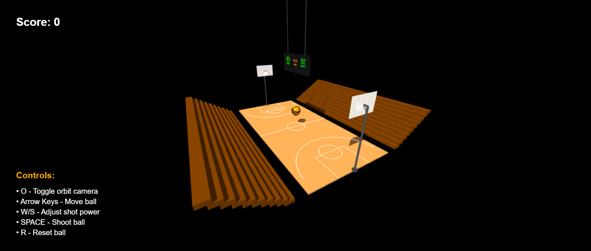

# HW05 - Interactive Basketball Court

## Group Members
- Avital Amikam, id 313589848
- Roni Salama, id 318224516

### How to Run the Project

1. Clone this repository to your local machine.  
2. Navigate to the project directory in your terminal.  
3. Ensure you have Node.js installed (you can download it from: [https://nodejs.org](https://nodejs.org))  
4. Install dependencies: `npm install`  
5. Start the local web server from the project root: `node index.js`  
6. Open your browser and navigate to: [http://localhost:8000](http://localhost:8000)

## Files Included
- index.html – entry point for the project
- hw5.js – main JavaScript file with the full implementation
- OrbitControls.js – orbit camera module for user interaction
- README.md – project documentation
- Screenshots (see below)

## Features Implemented
- Full basketball court with correct 2:1 proportions and brown wooden appearance.
- White court markings including:
  - Center line and center circle
  - Three-point arcs on both sides
  - Free throw areas with circles and painted zones
- Two basketball hoops, each with:
  - Backboard (white and semi-transparent)
  - Orange rim placed at realistic height
  - Support arm behind the backboard
  - Net made from 12 line segments
- A static basketball placed at center court:
  - Orange material with black seams
  - Proper size and geometry
- Lighting and shadows:
  - Ambient and directional light with shadow maps
- Orbit camera controls:
  - Camera placed above the scene, looking down at the court
  - Toggle orbit control with the **O** key
- UI framework prepared:
  - Score display
  - Instructions panel
- Bonus features implemented:
  - Stadium bleachers on both sides
  - 3D scoreboard suspended above the court with 3D text (score, period, clock)
  - More detailed court markings (free throw lines, key areas)

## Controls (for HW05 display)
- `O` key: Toggle orbit camera controls

## Screenshots

| Description                        | Image |
|------------------------------------|-------|
| Full court view                    |  |
| Close-up of basketball hoop & net |  |
| Ball at center court              |  |
| Orbit camera controls             |  |

